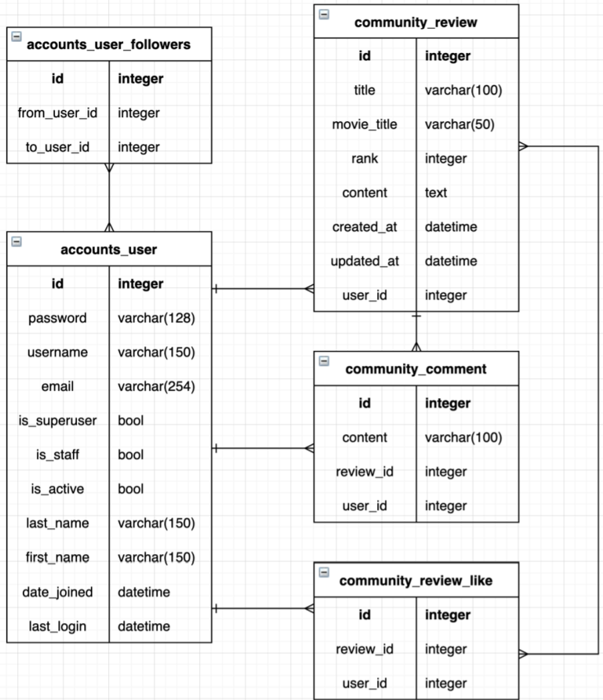

# pjt 07 - 관계형 데이터베이스 설계


## 1. 목표

- **데이터를 생성, 조회, 수정, 삭제 할 수 있는 Web Application 제작**
- **Python Web Framework를 통한 데이터 조작**
- **Authentication에 대한 이해**
- **Database 1:N, M:N 관계의 이해와 데이터 관계 설정**


## 2. 준비사항

- Python 3.8.7
- Django 3.1.7
- vsCode
- Chrome Browser


<br>

----

<br>


## 3. 요구 사항 및 구현 내용

#### A. 프로젝트 구조


#### 

#### B. Model

- 데이터베이스에서 모델의 ERD(Entity Relation Diagram)
- accounts_user는 django에서 제공하는 AbstractUser를 상속받아 User 모델 제작
- accounts_user_follwers는 User와 User를 M:N으로 연결시켜주기 위한 중개 테이블
- community_review는 accounts_user와 1:N 관계(글 작성을 위함), M:N 관계(좋아요 기능을 위함)을 가짐
  - M:N 관계를 위해 review 모델에 MTM필드(필드명 : like)를 만들어 community_review_like 중개 테이블을 만듬
- community_comment는 accounts_user와 1:N, community_review와 1:N 관계를 가짐



```python
# accounts/models.py
from django.db import models
from django.contrib.auth.models import AbstractUser


class User(AbstractUser):
    followers = models.ManyToManyField(
        'self', 
        symmetrical=False, 
        related_name='followings'
    )
```

```python
# community/models.py
from django.db import models
from django.conf import settings


class Review(models.Model):
    user = models.ForeignKey(settings.AUTH_USER_MODEL, on_delete=models.CASCADE)
    # user 입장에서의 related manager name : like_reviews
    like = models.ManyToManyField(
        settings.AUTH_USER_MODEL, 
        related_name='like_reviews'
    )   
    title = models.CharField(max_length=100)
    movie_title = models.CharField(max_length=50)
    rank = models.IntegerField()
    content = models.TextField()
    created_at = models.DateTimeField(auto_now_add=True)
    updated_at = models.DateTimeField(auto_now=True)

    def __str__(self):
        return self.title

class Comment(models.Model):
    user = models.ForeignKey(settings.AUTH_USER_MODEL, on_delete=models.CASCADE)
    review = models.ForeignKey(Review, on_delete=models.CASCADE)
    content = models.CharField(max_length=100)

    def __str__(self):
        return self.content
```

```bash
# terminal
$ python manage.py makemigrations
$ python manage.py migrate
```


#### C. URL

> URL은 app_name과 name을 설정하여 적용

- **accounts app**

  ```python
  # accounts/urls.py
  from django.urls import path
  from . import views
  
  
  app_name = 'accounts'
  urlpatterns = [
      path('signup/', views.signup, name='signup'),
      path('login/', views.login, name='login'),
      path('logout/', views.logout, name='logout'),
      path('<int:user_id>/', views.profile, name='profile'),
      path('<int:user_id>/follow/', views.follow, name='follow'),
  ]
  ```

- **community app**

  ```python
  # community/urls.py
  from django.urls import path
  from . import views
  
  
  app_name = 'community'
  urlpatterns = [
      path('', views.index, name='index'),
      path('create/', views.create, name='create'),
      path('<int:review_pk>/', views.detail, name='detail'),
      path('<int:review_pk>/comment', views.comments_create, name='comments_create'),
      path('<int:review_pk>/like/', views.like, name='like'),
  ]
  ```


#### D. View & Template

- **공유 템플릿 생성 및 사용**
  - 모든 HTML 파일은 base.html을 확장(extends)하여 사용
  - base.html은 모든 페이지가 공유하는 상단 네비게이션 바를 표시
  - 네비게이션 바
    - 전체 리뷰 목록 조회 페이지와 새로운 리뷰 작성 페이지로 이동할 수 있는 링크를 포함
    - 사용자가 인증되어 있지 않다면, 로그인 페이지와 회원 가입 페이지로 이동할 수 있는 링크를 포함
    - 사용자가 인증되어 있다면, 로그아웃할 수 있는 링크를 표시

```django
<!-- pjt07/templates/base.html -->



<!DOCTYPE html>
<html lang="en">
<head>
  <meta charset="UTF-8">
  <meta http-equiv="X-UA-Compatible" content="IE=edge">
  <meta name="viewport" content="width=device-width, initial-scale=1.0">
  
  <title>PJT07</title>
</head>
<body>
  <ul class="nav">
    <li class="nav-item">
      <a class="nav-link" href="">index</a>
    </li>
    <li class="nav-item">
      <a class="nav-link" href="">create</a>
    </li>
    
      <li class="nav-item">
        <form class="nav-link" action="" method="POST">
          
          <input type="submit" value="logout">
        </form>
      </li>
    
      <li class="nav-item">
        <a class="nav-link" href="">login</a>
      </li>
      <li class="nav-item">
        <a class="nav-link" href="">signup</a>
      </li>
    
  </ul>
  <div class="container">
    

    
  </div>
  
</body>
</html>
```

- **리뷰 좋아요 기능**
  - 단일 리뷰 상세 조회 페이지에 좋아요 버튼과 좋아요 개수를 출력
  - 이미 좋아요 버튼을 누른 경우 취소 버튼을 출력
  - 인증된 사용자만 리뷰에 좋아요 할 수 있음

```django
<!-- community/templates/community/detail.html -->

...

  <form action="" method='POST'>
    
    <!-- 좋아요를 이미 눌렀던 경우 --> 
    
      <button class="btn btn-primary">좋아요 취소</button>
    
      <!-- 아닌 경우 구분 -->
      <button class="btn btn-primary">좋아요</button>
    
  </form>
  <!-- 이 게시글을 좋아요를 누른 user의 수 -->
  <p>좋아요 {{ review.like.all|length }}</p>
  <hr>

...
```

```python
# community/views.py

@require_POST
def like(request, review_pk):
    # 1. 로그인을 했는지 조사
    if request.user.is_authenticated:
    # 로그인 한 유저라면 (인증된 사용자라면)
        review = get_object_or_404(Review, pk=review_pk)
        # 2번째 조사 -> 좋아요를 눌렀던 사람인지 아닌지
        if review.like.filter(pk=request.user.pk).exists():
            # 이미 좋아요 버튼을 누른 경우 -> 좋아요 취소
            review.like.remove(request.user)
        else:
            # 아닌 경우 -> 좋아요
            review.like.add(request.user)
        return redirect('community:detail', review.pk)
    # 로그인 하지 않은 user는 login으로 ...
    return redirect('accounts:login')
```

- **유저 팔로우 기능**
  - 사용자 상세 페이지에 팔로우 버튼과 팔로우수를 출력
  - 이미 팔로우 버튼을 누른 경우 취소 버튼을 출력
  - 인증된 사용자만 팔로우 할 수 있음
  - 로그인한 사용자 자신은 팔로우 할 수 없음

```django
<!-- community/index.html -->

...
<!-- 작성자(username)를 클릭하면, 그 user의 사용자 상세 페이지 요청 -->
<p>작성자 : <a href="">{{ review.user.username }}</a></p>

...
```

```python
# accounts/views.py

@require_safe
def profile(request, user_id):
    person = get_object_or_404(User, pk=user_id)
    context = {
        'person': person,
    }
    return render(request, 'accounts/profile.html', context)
```

```django
<!-- accounts/templates/accounts/profile.html -->




  <h1>{{ person.username }}</h1>
  <!-- 나를 팔로우 하는 사람의 수 -->
  <p>팔로워 {{ person.followers.all|length }}</p>
  <!-- 내가 팔로우 하는 사람의 수 -->
  <p>팔로우 {{ person.followings.all|length }}</p>

  <!-- request.user가 이 페이지의 user가 아니라면 : 버튼이 있어야한다. -->
  <!-- request.user가 인증(authenticated)된 유저라면 : 버튼이 있어야한다. -->
  
    <form action="" method="POST">
      
      <!-- person의 followers 중에 request.user가 있니? -->
      
        <!-- 있다면 -->
        <button class="btn btn-primary">팔로우 취소</button>
      
        <!-- 없다면 -->
        <button class="btn btn-primary">팔로우</button>
      
    </form>
  

    

```

```python
# accounts/views.py

@require_POST
def follow(request, user_id):
    # 로그인 했는지 조사
    if request.user.is_authenticated:
    # 로그인 했다면
        person = get_object_or_404(User, pk=user_id)
        # 팔로우를 하려면 요청한 user 와 person이 달라야죠 
        if request.user != person:
            # 이미 팔로우 한 유저인지 아닌지 조사
            if person.followers.filter(pk=request.user.pk).exists():
                person.followers.remove(request.user)
            else:
                person.followers.add(request.user)
        return redirect('accounts:profile', person.pk)
    return redirect('accounts:login')
```

